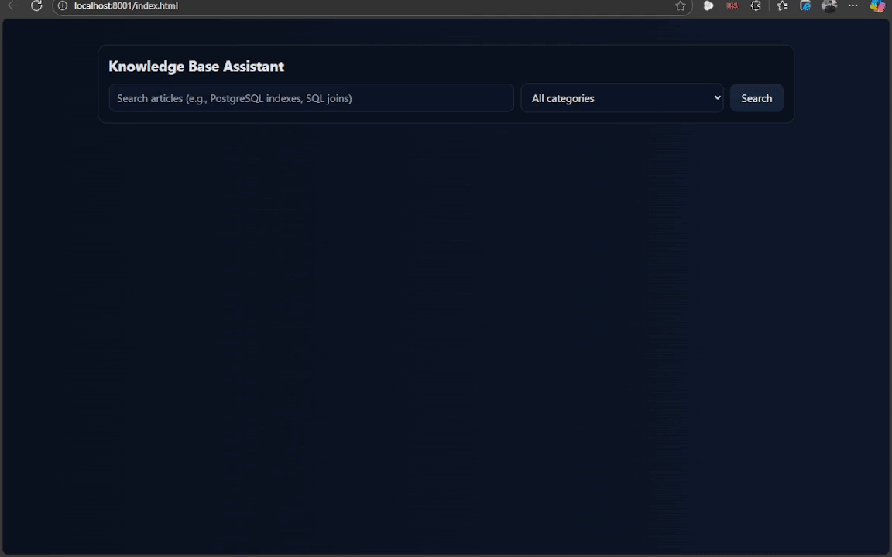

# Knowledge Base Assistant
## Table of Contents

1. [Knowledge Base Assistant – Backend](#knowledge-base-assistant-backend)
  1.1. [Prerequisites](#prerequisites)
  1.2. [Quick Start](#quick-start)
    1.2.1. [1) Clone & enter the backend folder](#1-clone-enter-the-backend-folder)
    1.2.2. [2) Create and activate a virtual environment](#2-create-and-activate-a-virtual-environment)
    1.2.3. [3) Configure environment variables](#3-configure-environment-variables)
    1.2.4. [4) Initialize the database (auto-create + schema + seed)](#4-initialize-the-database-auto-create-schema-seed)
2. [Windows PowerShell or Linux/macOS (after activating venv)](#windows-powershell-or-linuxmacos-after-activating-venv)
    2.1. [5) Run the API](#5-run-the-api)
  2.1. [Project Structure](#project-structure)
  2.2. [Troubleshooting](#troubleshooting)
  2.3. [Indexing & Performance Gain for Database Queries](#indexing-performance-gain-for-database-queries)
    2.3.1. [Search Performance & Indexing Notes](#search-performance-indexing-notes)
    2.3.2. [How the benchmark was run](#how-the-benchmark-was-run)
    2.3.3. [Results (example run)](#results-example-run)
    2.3.4. [Indexes and why they help](#indexes-and-why-they-help)
    2.3.5. [Short Demo Script](#short-demo-script)
  2.4. [LLM Integration](#llm-integration)
    2.4.1. [Configure your `.env`](#configure-your-env)
    2.4.2. [Example: Ask the LLM](#example-ask-the-llm)
3. [Knowledge Base Assistant – Frontend](#knowledge-base-assistant-frontend)
  3.1. [Prerequisites](#prerequisites)
  3.2. [Quick Start](#quick-start)
    3.2.1. [1) Clone & enter the frontend folder](#1-clone-enter-the-frontend-folder)
    3.2.2. [2) Run locally](#2-run-locally)
4. [Example with Python’s simple HTTP server](#example-with-pythons-simple-http-server)
5. [Then open http://localhost:8080/index.html](#then-open-httplocalhost8080indexhtml)
    5.1. [3) Adjust backend URL if needed](#3-adjust-backend-url-if-needed)
  5.1. [UI & UX Approach](#ui-ux-approach)
  5.2. [Usage](#usage)
  5.3. [Demo](#demo)
  5.4. [Run with Docker](#run-with-docker)
    5.4.1. [1) Build and start](#1-build-and-start)
    5.4.2. [2) Configure environment](#2-configure-environment)
    5.4.3. [3) Health checks](#3-health-checks)
    5.4.4. [4) Stopping](#4-stopping)

---
# Knowledge Base Assistant – Backend

FastAPI + PostgreSQL backend for the Intelligent Knowledge Base Assistant.

## Prerequisites
- Python 3.10+
- PostgreSQL 13+ reachable at your configured host
- (Optional) `psql` CLI for troubleshooting

## Quick Start

### 1) Clone & enter the backend folder
```bash
cd knowledge-base-assistant-oguz/backend
```

### 2) Create and activate a virtual environment

**Windows (PowerShell)**
```powershell
python -m venv venv
.venv\Scripts\Activate.ps1
pip install --upgrade pip
pip install -r requirements.txt
```

**Linux / macOS**
```bash
python3 -m venv venv
source venv/bin/activate
pip install --upgrade pip
pip install -r requirements.txt
```

### 3) Configure environment variables
Create a `.env` in the repo root (sibling to `backend/`) or export env vars in your shell. A template is provided as `.env.example`.

Defaults (used if env vars are not set) are:
```
PG_HOST=macbook-server
PG_PORT=5432
PG_USER=postgres
PG_PASSWORD=Postgres2839*
PG_DBNAME=KnowledgeBaseAssistant
USE_INDEXES=true
```

### 4) Initialize the database (auto-create + schema + seed)
From the **backend** folder:
```bash
# Windows PowerShell or Linux/macOS (after activating venv)
python init_db.py
```
This will:
- Ensure the database exists (create if missing by connecting to the `postgres` maintenance DB).
- Apply `./data/schema.sql`.
- Seed authors, categories, tags, and sample articles (idempotent).

### 5) Run the API
```bash
uvicorn app:app --reload --host 0.0.0.0 --port 8000
```
Health check: http://localhost:8000/health  
Search endpoint example: `GET /api/search?query=mastering`

## Project Structure
```
backend/
  app.py            # FastAPI app: /health, /api/search, /api/ask (LLM stub)
  db.py             # PG connection + simple query helpers
  init_db.py        # Creates DB if missing, applies schema, seeds data
  llm.py            # Minimal OpenAI integration
  requirements.txt  # Python deps
  data/
    schema.sql               # Tables, indexes, triggers for FTS + category/date index
    schema_no_index.sql      # Tables and releations only
.env.example        # Sample env config (at repo root)
```

## Troubleshooting
- **Cannot create database / transaction error**: `CREATE DATABASE` must run outside a transaction. Ensure the initializer uses autocommit when connecting to the `postgres` DB.
- **File not found (schema.sql)**: Run `python init_db.py` from the `backend` directory so the relative `data/schema.sql` path resolves.
- **Connection refused**: Verify host/port/credentials, and that PostgreSQL accepts connections from your machine.

## Indexing & Performance Gain for Database Queries
### Search Performance & Indexing Notes

This section summarizes the search performance of the `/api/search` endpoint **with** and **without** indexes, and explains each index used and why it helps.

The API itself logs and returns timing metrics (`db_ms`, `total_ms`) for each search query. See the FastAPI handler in `app.py` for details. The database schema applied depends on the `USE_INDEXES` flag in `.env`, as handled in `init_db.py`.

### How the benchmark was run

- Endpoint: `GET /api/search?query=SQL`
- Dataset: Seeded by `init_db.py` (24 articles with tags).
- Two runs:
  1. **Without indexes** – baseline using substring search (`ILIKE`).  
  2. **With indexes** – using FTS + trigram indexes for filtering and ranking.

### Results (example run)
**Request** 
```
http://localhost:8000/api/search?query=SQL
```

With Indexes:
```json
{
  "results": [
    {
      "id": 3,
      "title": "Effective SQL Joins: Inner vs Outer",
        ....
    },
    {
      "id": 9,
      "title": "Full-Text Search with PostgreSQL",
      ....
    },
    {
      "id": 2,
      "title": "Demystifying PostgreSQL Indexes",
        ....
    }
  ],
  "metrics": {
    "db_ms": 90,
    "total_ms": 90.01
  }
}
```

Without Indexes:
```json
{
  "results": [
    {
      "id": 9,
      "title": "Full-Text Search with PostgreSQL",
      ....
    },
    {
      "id": 3,
      "title": "Effective SQL Joins: Inner vs Outer",
      ....
    },
    {
      "id": 2,
      "title": "Demystifying PostgreSQL Indexes",
       ....
    }
  ],
  "metrics": {
    "db_ms": 129.36,
    "total_ms": 129.36
  }
}
```

On this dataset and query, indexes reduced database execution time from ~129.36 ms to ~90 ms (≈ 30% faster).
As the corpus scales, the gap grows significantly because indexes avoid full table scans and expensive text processing.

### Indexes and why they help

#### Full-text search (FTS) GIN index

```sql
CREATE INDEX IF NOT EXISTS idx_articles_search_vector
  ON articles USING GIN (search_vector);
```
- `search_vector` stores a weighted `tsvector(title, content)` updated by a trigger.
- GIN allows `@@` matches (`to_tsquery`, `websearch_to_tsquery`) to skip scanning every row.
- Speeds up `ts_rank(search_vector, query)` ranking.

#### Trigger to keep `search_vector` updated

```sql
CREATE OR REPLACE FUNCTION articles_tsv_update() RETURNS trigger AS $$
BEGIN
  NEW.search_vector :=
    setweight(to_tsvector('english', coalesce(NEW.title,'')), 'A') ||
    setweight(to_tsvector('english', coalesce(NEW.content,'')), 'B');
  RETURN NEW;
END
$$ LANGUAGE plpgsql;

DROP TRIGGER IF EXISTS trg_articles_tsv_update ON articles;
CREATE TRIGGER trg_articles_tsv_update
BEFORE INSERT OR UPDATE ON articles
FOR EACH ROW EXECUTE FUNCTION articles_tsv_update();

-- Backfill existing rows
UPDATE articles SET title = title;
```
- Ensures the materialized `search_vector` is always in sync.
- Makes sure the FTS index is useful immediately after updates.

#### Composite index for category filtering + date sorting

```sql
CREATE INDEX IF NOT EXISTS idx_articles_category_date
  ON articles (category_id, publish_date);
```
- The API filters by category and sorts by publish date.
- This composite index supports that pattern directly, cutting sort/filter cost.

#### Trigram indexes for substring search (`ILIKE`)

```sql
CREATE EXTENSION IF NOT EXISTS pg_trgm;

CREATE INDEX IF NOT EXISTS idx_articles_title_trgm
  ON articles USING GIN (title gin_trgm_ops);

CREATE INDEX IF NOT EXISTS idx_articles_content_trgm
  ON articles USING GIN (content gin_trgm_ops);
```

- Substring queries like `ILIKE '%SQL%'` match “PostgreSQL”.
- Trigram indexes make these substring searches fast (otherwise they require sequential scans).
- Preserves recall identical to the baseline but with large performance gains.

### Short Demo Script
This script shows how to run complex searches (with query + category/tags) and then get an LLM answer grounded in selected results.

#### Complex search query
```http
GET http://localhost:8000/api/search?query=python&category=DevOps&tags=indexes&limit=5
```
**Example Response**
```json
{
  "results": [
    {
      "id": 8,
      "title": "Typing in Python: When and Why",
      "excerpt": "Typing in Python: When and Why\n\nThis article explores practical techniques...",
      "publish_date": "2025-05-22",
      "author_id": 4,
      "author_name": "Linus Craft",
      "author_bio": "Systems programmer exploring performance and tooling.",
      "category_id": 4,
      "category_name": "DevOps",
      "tags": "indexes, ORM, rag, testing, vector",
      "rank": 0.66871977
    }
  ],
  "metrics": {
    "db_ms": 72.66,
    "total_ms": 72.66
  }
}
```
Then you can show how to use /api/ask with the returned id:
```http
POST http://localhost:8000/api/ask
Content-Type: application/json

{
  "context_ids": [8],
  "question": "What are the trade-offs of using typing in Python for DevOps codebases?"
}
```
**Example LLM response**
```json
{
  "answer": "Typing in Python can improve maintainability and tooling support in DevOps codebases, but it may add overhead when teams lack experience. The article 'Typing in Python: When and Why' notes that annotations help catch errors earlier and integrate better with IDEs, but they can slow rapid prototyping and require discipline to keep in sync with actual code.",
  "used_article_ids": [8]
}
```

#### Notes for Reviewers
- Complexity knobs: You can mix free-text queries with category and tags (including exclusions) to stress the retrieval layer.
- Grounded answers: /api/ask only uses the IDs you select, ensuring the model’s answer cites/reasons over the chosen results.
- UI/UX: The chat bubble for the LLM answer appears directly under your question; results are selectable via checkboxes before asking.
- Error handling: The UI shows “No results found” and loading spinners; the API returns 400 for malformed queries.

## LLM Integration

This project uses a minimal OpenAI integration in `backend/llm.py` (no heavy frameworks). It:
- Loads your API key from `.env` (at the repo root) and uses the `openai` client.
- Builds a compact prompt from selected article chunks.
- Budgets context size using a simple word-count proxy and summarizes if needed.
- Returns a concise answer strictly from the provided context.

### Configure your `.env`
Copy `.env.example` to `.env` at the **repo root** and set:

```
OPENAI_MODEL=gpt-3.5-turbo
OPENAI_API_KEY=your_openai_api_key_here
```

> Tip: You can switch to another compatible model by changing `OPENAI_MODEL`. Keep the same format.

### Example: Ask the LLM

**HTTP POST**  
`http://localhost:8000/api/ask`

**Request body**
```json
{
  "context_ids": [2],
  "question": "Can I find code snippets about PostgreSQL Indexes?"
}
```

**Response**
```json
{
  "answer": "Yes, you can find code snippets about PostgreSQL Indexes in the article \"Demystifying PostgreSQL Indexes.\"",
  "used_article_ids": [2]
}
```

# Knowledge Base Assistant – Frontend

Single-page UI built with **Vue 3 (CDN build)** and plain CSS. It connects to the FastAPI backend and provides a smooth interface for searching knowledge base articles and asking AI questions.

## Prerequisites
- A modern web browser (Chrome, Firefox, Edge, Safari).
- Backend API running locally (default `http://localhost:8000` as in [backend README]).

## Quick Start

### 1) Clone & enter the frontend folder
```bash
cd knowledge-base-assistant-oguz/frontend
```

### 2) Run locally
Just open `index.html` in your browser. No build step required since Vue is loaded via CDN.

If you want hot reload or static serving:
```bash
# Example with Python’s simple HTTP server
python -m http.server 8080
# Then open http://localhost:8080/index.html
```

### 3) Adjust backend URL if needed
In `index.html`, update:
```js
baseUrl: "http://localhost:8000"
```
to match your backend port/host.

## UI & UX Approach

I designed the UI to keep **searching, selecting, and asking questions** simple:

1. **Search Bar**  
   - Enter a keyword and optionally choose a category.  
   - Results are fetched asynchronously without blocking the UI.

2. **Search Results as Cards**  
   - Each article appears as a card with title, author, date, excerpt, and tags.  
   - Each card includes a **checkbox** so multiple articles can be selected at once.

3. **Ask AI Workflow**  
   - Instead of typing per-result questions, you select relevant articles first.  
   - At the bottom, there is a single **Ask AI input + button**.  
   - When you ask, all selected article IDs are sent to the backend in the `context_ids` array.  
   - This encourages **focused, context-driven queries** rather than scattered prompts.

4. **Chat Bubble Layout**  
   - Questions and answers are rendered in conversational “turns.”  
   - Each **user question bubble** is directly followed by the **AI’s answer bubble**.  
   - This keeps dialogue clear and avoids mixing with search results.

5. **Visual Design**  
   - Dark theme with card-based layout.  
   - Tags and metadata are shown in muted tones for readability.  
   - Spinners indicate loading states to improve perceived responsiveness.

## Usage

1. **Search** – Type in keywords (e.g., `PostgreSQL indexes`) and hit *Enter* or click *Search*.  
2. **Select** – Check the boxes next to articles you want to use as context.  
3. **Ask AI** – Enter your question in the ask bar and click *Ask AI*.  
4. **Read** – See the AI’s response appear directly under your question in the chat section.  
5. **Iterate** – Repeat search and questions as needed; the chat keeps history of your Q&A turns.

## Demo
I will include a short animated GIF here to illustrate the flow:


## Run with Docker

Instead of setting up Python and PostgreSQL manually, you can run the full stack (Postgres + FastAPI backend + Vue frontend) using **Docker Compose**.

### 1) Build and start
From the repo root (where `docker-compose.yml` lives):
```bash
docker compose up --build
```

This will:
- Initialize a PostgreSQL database (with schema + seed data).
- Start the FastAPI backend on **http://localhost:8000**.
- Serve the static frontend on **http://localhost:8001**.
- Orchestrate all processes (Postgres, DB init, backend, frontend) under Supervisor.

### 2) Configure environment
Copy `.env.example` to `.env` in the repo root and adjust as needed:
```bash
PG_HOST=localhost
PG_PORT=5432
PG_USER=postgres
PG_PASSWORD=postgres
PG_DBNAME=KnowledgeBaseAssistant
USE_INDEXES=true
OPENAI_MODEL=gpt-3.5-turbo
OPENAI_API_KEY=your_openai_api_key_here
```
These variables are used by the backend for database connections, schema initialization, and LLM integration.

### 3) Health checks
- **API health**: http://localhost:8000/health should return `{"status":"ok"}`
- **Search**: http://localhost:8000/api/search?query=SQL
- **Frontend UI**: http://localhost:8001 (connects to the backend at `localhost:8000`)

### 4) Stopping
```bash
docker compose down
```
This stops and removes the container but keeps your database data in the named volume.